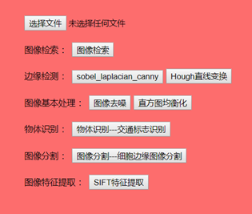

## 介绍

天津工业大学计算机视觉大作业。


## 首页




## 用法

我自己这边的环境：

1. python >= 3.6
2. keras == 2.0.5
3. flask == 1.1.1

后面默认你已经装好了环境。

## 下载

```sh
$ git clone https://github.com/WGwg/cvProject.git

$ cd cvProject
```

### 目录

```

```

### 只有图像检索需要 提取特征

```sh
$ python index.py -database <path-to-dataset> -index <name-for-output-index>
```
生成的是 h5 格式的文件，把它放到 model 中。

### 其他的图像基本处理不需要


### 运行

```sh
$ flask run 
```

